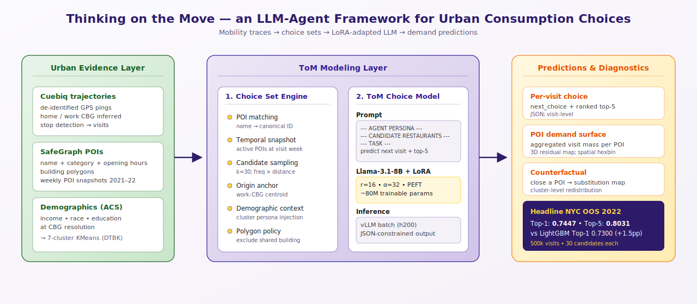
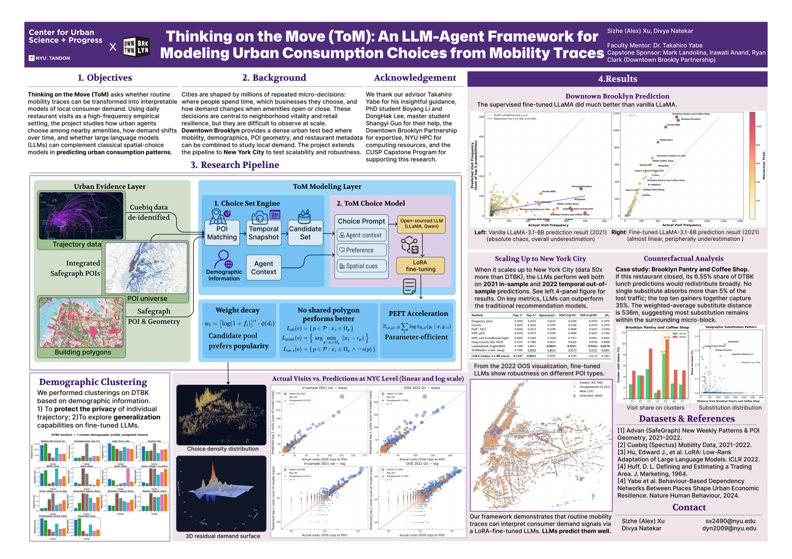
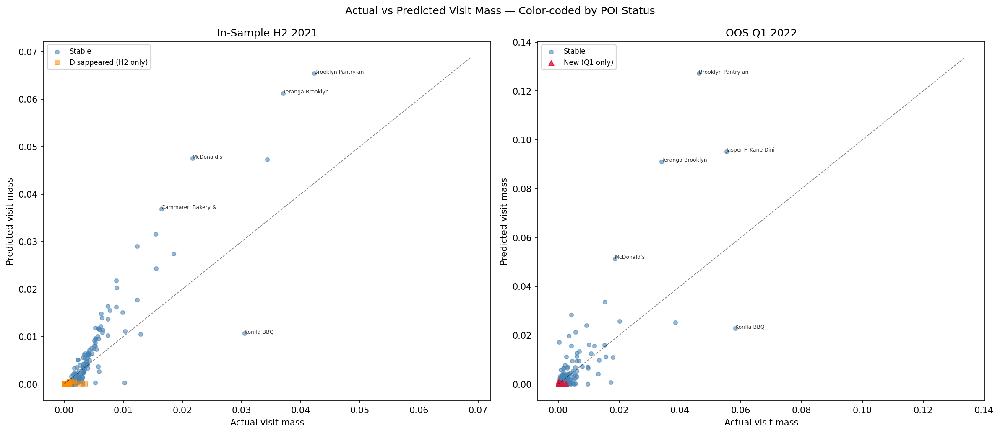
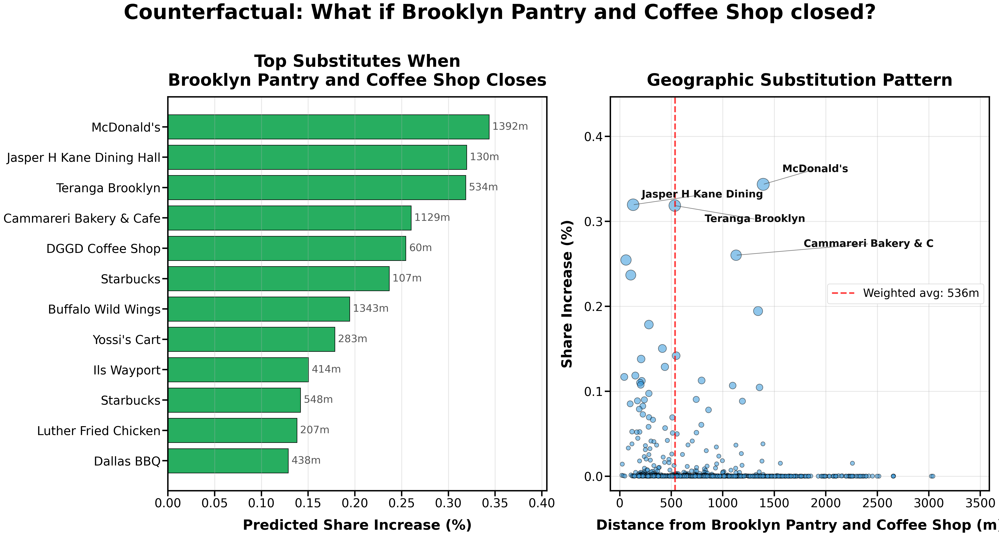

<div align="center">

<h1>Thinking on the Move (ToM) </h1>

### *An LLM-Agent Framework for Modeling Urban Consumption Choices from Mobility Traces*

[](LICENSE)
[](pyproject.toml)
[](https://huggingface.co/MazelTovy/thinking-on-the-move-dtbk)
[](https://huggingface.co/MazelTovy/thinking-on-the-move-nyc)
[](docs/poster.pdf)

<p>
<b>Cities are shaped by millions of repeated micro-decisions.</b><br>
We turn anonymous mobility traces into <i>interpretable</i> models of where people choose to eat lunch &mdash;<br>
and show that a <b>fine-tuned Llama-3.1-8B</b> beats every classical spatial-choice baseline on <b>Top-1</b> and <b>Top-5</b> accuracy.
</p>

<a href="docs/poster.pdf"></a>

</div>

---

## What this repo answers

> *Given anonymous GPS traces of where people work, when they pause for lunch, and what shops surround them &mdash; can a language model predict who eats where, and explain why?*

We test this in two cities of very different scale:

| Setting | Period | Workers | POIs | Visits | Result |
|---|---|---:|---:|---:|---|
| **Downtown Brooklyn (DTBK)** | 2022 Q1 OOS | ~2k | 667 | 6k | LoRA-Llama recovers per-POI demand structure that vanilla Llama misses entirely. |
| **NYC Metro** | 2022 OOS | ~70k | 57k | 500k | LoRA-Llama posts the **best Top-1 (0.7447)** and **Top-5 (0.8031)** of any of 9 methods evaluated. |

We then run a **counterfactual closure** of one shop (Brooklyn Pantry & Coffee), and the model produces a fine-grained substitution map &mdash; >35% of the lost lunch traffic redistributes to ten neighbors at a weighted-average distance of **536 m**.

---

## The framework, in three layers

<table>
<tr>
<td width="33%" valign="top">

**🛰 Urban Evidence**
- de-identified GPS pings (Cuebiq)
- POI universe + opening weeks (SafeGraph)
- block-level demographics (ACS)

</td>
<td width="33%" valign="top">

**🧩 Choice Set Engine**
- POI matching → canonical IDs
- temporal snapshot per visit week
- spatially-weighted candidate sampling (k=30)
- demographic persona injection
- polygon-aware (skip shared buildings)

</td>
<td width="33%" valign="top">

**🤖 ToM Choice Model**
- prompt = persona + candidates + task
- Llama-3.1-8B + LoRA (r=16, α=32)
- ~80M trainable params
- vLLM batch inference, JSON-constrained
- per-visit choice + ranked top-5

</td>
</tr>
</table>

See [`docs/methodology.md`](docs/methodology.md) for a full pipeline walkthrough.

---

## Headline results

### NYC Metro &mdash; 2022 out-of-sample, 500k visits

| Method | Top-1 ↑ | Top-5 ↑ | Spearman ↑ | NDCG@10 ↑ | NDCG@50 ↑ | JS ↓ |
|---|---:|---:|---:|---:|---:|---:|
| Frequency prior              | 0.2034 | 0.4572 | 0.5612 | 0.5100 | 0.5919 | 0.1970 |
| Gravity                       | 0.2025 | 0.4522 | 0.5599 | 0.5100 | 0.5919 | 0.1970 |
| Huff / MCI                    | 0.2034 | 0.4572 | 0.5590 | 0.4838 | 0.5657 | 0.1944 |
| MNL-grid                      | 0.2034 | 0.4572 | 0.5590 | 0.4838 | 0.5657 | 0.1944 |
| MNL-rich (conditional logit)  | 0.6495 | 0.7603 | 0.7620 | 0.7917 | 0.8451 | 0.0623 |
| Deep Gravity (lite MLP)       | 0.7237 | 0.7986 | 0.8013 | 0.8183 | 0.8746 | 0.0488 |
| LambdaRank (LightGBM)         | 0.7300 | 0.8017 | **0.8029** | **0.9527** | **0.9561** | **0.0478** |
| XGBRanker (rank:ndcg)         | 0.7282 | 0.8025 | _0.8012_ | _0.9173_ | _0.9121_ | _0.0491_ |
| **LoRA-Llama-3.1-8B (ours)**  | **0.7447** | **0.8031** | 0.5935 | 0.5109 | 0.6112 | 0.1967 |

> **Read this as:** the four popularity/distance-only baselines collapse to popularity (β → 0) because the candidate sampler has already pre-filtered for distance. The LLM beats the strongest classical ranker by **+1.47 pp** on Top-1, but trades aggregate ranking sharpness (NDCG/Spearman) for per-visit decisiveness. Why? See the *Discussion* section in [`docs/methodology.md`](docs/methodology.md).

### Downtown Brooklyn &mdash; before vs. after fine-tuning

<div align="center">

<br>
<sub>Each dot = one POI. <b>x</b> = actual 2022 Q1 visit count. <b>y</b> = predicted top-5 mass. Vanilla Llama-3.1-8B is chaotic; the LoRA-fine-tuned variant aligns sharply with observed demand.</sub>
</div>

### Counterfactual: what if Brooklyn Pantry & Coffee closed?

<div align="center">

<br>
<sub>The model predicts the lost <b>6.55%</b> demand share fans out across <b>~10 nearest substitutes</b> (weighted-avg distance <b>536 m</b>). No single shop absorbs more than 5% of the redistribution.</sub>
</div>

Full per-cluster breakdown (which demographic groups felt the loss most) is in [`results/counterfactual_brooklyn_pantry.json`](results/counterfactual_brooklyn_pantry.json).

---

## Get started

### 1. Inspect the toy demo (no GPU, no real data, no setup beyond `pip install -e .`)

```bash
git clone https://github.com/MazelTovy/thinking-on-the-move
cd thinking-on-the-move
pip install -e .
jupyter notebook notebooks/01_pipeline_overview.ipynb
```

The synthetic toy dataset under [`data/synthetic/`](data/synthetic/) mirrors the schema of the real pipeline (50 workers × 80 POIs × 1000 visits across DTBK-shaped geography) so every notebook runs end-to-end without access to Cuebiq or SafeGraph.

### 2. Run a real LoRA inference (needs the HF adapter + a Llama-3.1-8B base)

```bash
pip install -e ".[infer]"

# Pull the DTBK adapter
huggingface-cli download MazelTovy/thinking-on-the-move-dtbk --local-dir ./dtbk_adapter

# Inference on the toy val set
python -m tom.core.infer_vllm \
    --records_in data/synthetic/toy_inference_records.jsonl \
    --model_path meta-llama/Llama-3.1-8B-Instruct \
    --lora_path ./dtbk_adapter \
    --out predictions.jsonl \
    --max_model_len 4096 --temperature 0.2
```

### 3. Reproduce the poster's figures from cached predictions

```bash
bash scripts/reproduce_poster_figures.sh
```

### 4. Train your own LoRA from scratch

You will need access to the underlying mobility data (Cuebiq + SafeGraph licensed). See [`docs/data_sources.md`](docs/data_sources.md) for procurement. Then:

```bash
pip install -e ".[train]"
python -m tom.core.data_prep --a_work data/raw/a_work_2021.csv --out_train train.jsonl --out_val val.jsonl
python -m tom.core.train_lora --train_jsonl train.jsonl --val_jsonl val.jsonl --output_dir ./adapter
python -m tom.core.infer_vllm --records_in val_records.jsonl --lora_path ./adapter/final --out preds.jsonl
python -m tom.visualize.temporal_eval --pred_test preds.jsonl --out_dir eval/
```

End-to-end on a single H100 with 1M training visits: ~20h walltime (prep 1h, train 18h, infer+eval 1h).

---

## Repository layout

```
thinking-on-the-move/
├── README.md                ← you are here
├── LICENSE                  ← MIT
├── pyproject.toml
├── docs/
│   ├── poster.pdf           ← the original CUSP capstone poster (P38)
│   ├── methodology.md       ← detailed pipeline + design choices
│   ├── data_sources.md      ← Cuebiq / SafeGraph / ACS access
│   └── reproducing_poster.md
├── figures/
│   ├── architecture/        ← hero SVG
│   ├── nyc/                 ← 4-panel scatter, 3D residual surface, hexbin maps
│   ├── dtbk/                ← vanilla vs fine-tuned LLaMA scatters
│   ├── counterfactual/      ← Brooklyn Pantry closure cards
│   └── demographic/         ← 7-cluster radar, heatmap, category mix
├── results/
│   ├── nyc_metrics.json     ← the headline 9-method comparison table
│   ├── dtbk_metrics.json
│   └── counterfactual_brooklyn_pantry.json
├── src/tom/                 ← `pip install -e .` exposes `tom.*`
│   ├── utils.py             ← POI ID, distance, candidate sampler
│   ├── core/                ← poster pipeline core
│   │   ├── data_prep.py             ← SFT data prep (cluster pools → personas → train/val)
│   │   ├── train_lora.py            ← LoRA fine-tuning entry (Llama / Qwen)
│   │   ├── infer_vllm.py            ← vLLM batch inference (parallel candidate sets)
│   │   └── prepare_synthetic_unseen.py ← cold-start hold-out (poster exp03)
│   ├── baselines/           ← 8 classical baselines + comparator
│   │   ├── classical.py             ← frequency / gravity / Huff / MNL-grid /
│   │   │                              MNL-rich / Deep Gravity / LightGBM / XGBRanker
│   │   └── compare.py               ← multi-method comparison utility
│   ├── visualize/           ← poster figure generation
│   │   ├── scatter_4panel.py        ← the 4-panel actual-vs-predicted chart
│   │   ├── temporal_eval.py         ← residual maps, density plots, NDCG curves
│   │   └── visualize_map.py         ← html basemap-backed spatial maps
│   ├── data_pipeline/       ← raw-data ingestion (Cuebiq / SafeGraph / ACS)
│   │   ├── download_wpp.py
│   │   ├── download_acs.py
│   │   ├── extract_global_places.py
│   │   ├── bridge_wpp_globalplaces.py
│   │   ├── resolve_poi_names.py
│   │   ├── build_polygon_index.py
│   │   ├── match_stops.py
│   │   └── demographics_clustering.py ← KMeans → 7 clusters (poster panel)
│   ├── ablations/           ← paper-track ablations (10 scripts)
│   └── dtbk/                ← DTBK-side helpers (cluster demographics plots,
│                              per-method Pearson, unified table, …)
├── notebooks/
│   ├── 01_pipeline_overview.ipynb
│   ├── 02_dtbk_walkthrough.ipynb
│   ├── 03_nyc_scaling.ipynb
│   └── 04_counterfactual_demo.ipynb
├── data/
│   ├── synthetic/           ← runnable toy data (50 workers, 80 POIs, 1000 visits)
│   └── README.md            ← raw data access
├── models/
│   ├── dtbk-lora/README.md  ← model card (weights live on HuggingFace)
│   └── nyc-lora/README.md
└── scripts/
    └── reproduce_poster_figures.sh
```

---

## Citation

```bibtex
@unpublished{xu2026tom,
  title  = {Thinking on the Move: An LLM-Agent Framework for Modeling
            Urban Consumption Choices from Mobility Traces},
  author = {Xu, Sizhe},
  year   = {2026},
  note   = {NYU Center for Urban Science and Progress, Capstone Project;
            in collaboration with the Downtown Brooklyn Partnership.}
}
```

If you use the released LoRA adapters, please also cite the base model:

```bibtex
@misc{dubey2024llama3,
  title={The Llama 3 Herd of Models},
  author={Dubey, Abhimanyu and others},
  year={2024},
  eprint={2407.21783},
  archivePrefix={arXiv}
}
```

---

## Acknowledgements

We thank our advisor **Dr. Takahiro Yabe** (NYU CUSP) for sustained guidance on the framework design and ablation philosophy; PhD student **Boyang Li** and **DongHak Lee**, master's student **Shangyi Guo** and for their help.

Capstone sponsorship and Downtown Brooklyn data context provided by the **Downtown Brooklyn Partnership** &mdash; **Mark Landolina**, **Irawati Anand**, and **Ryan Clark**.

NYU HPC (Greene + Torch clusters) and the **CUSP Capstone Program** provided the computing resources and academic structure that made this work possible.

---

<div align="center">
<sub>
<a href="docs/poster.pdf">Capstone Poster (PDF)</a>
&nbsp;·&nbsp;
<a href="https://huggingface.co/MazelTovy/thinking-on-the-move-dtbk">DTBK adapter</a>
&nbsp;·&nbsp;
<a href="https://huggingface.co/MazelTovy/thinking-on-the-move-nyc">NYC adapter</a>
&nbsp;·&nbsp;
<a href="mailto:sx2490@nyu.edu">sx2490@nyu.edu</a>
</sub>
</div>
